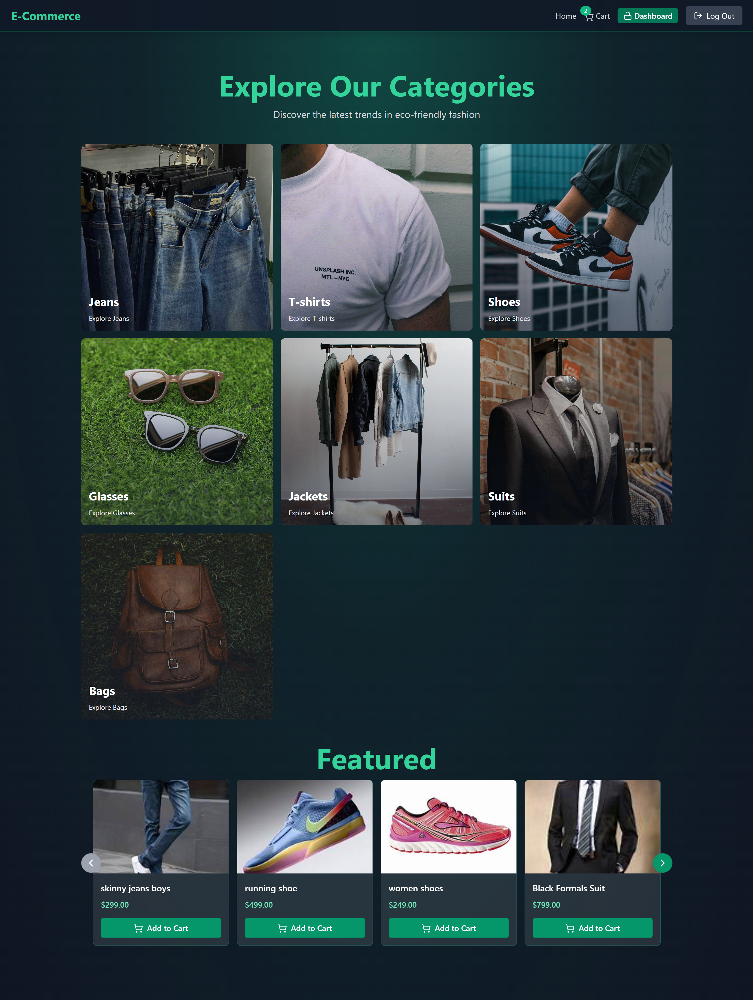
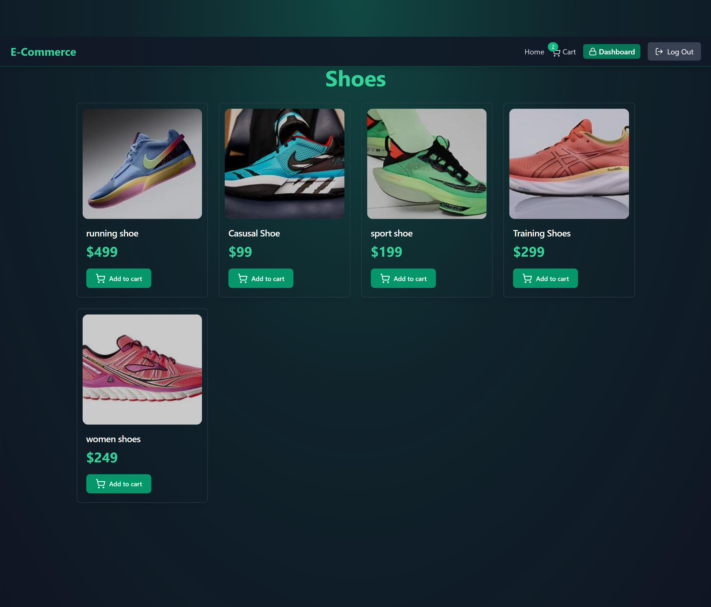
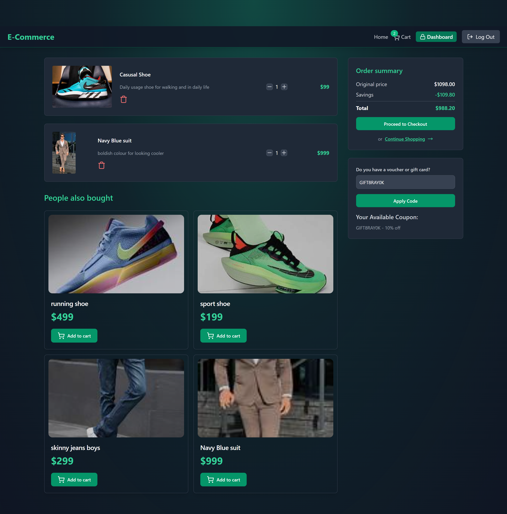
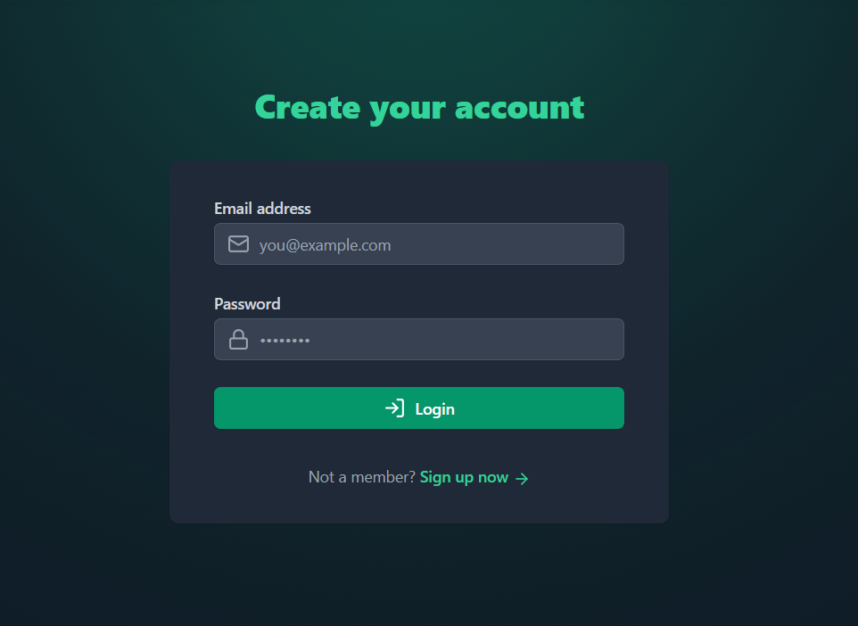
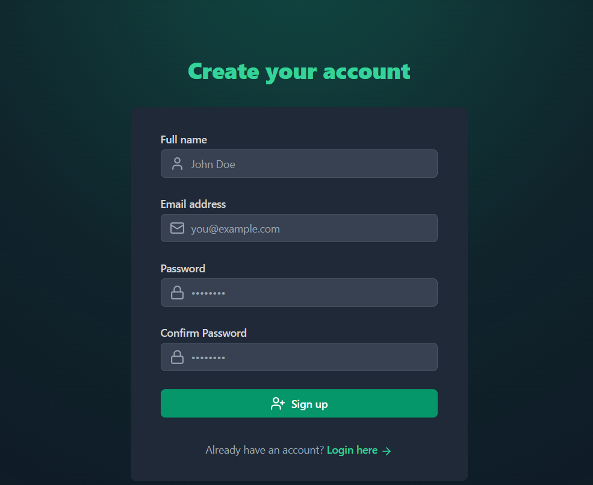
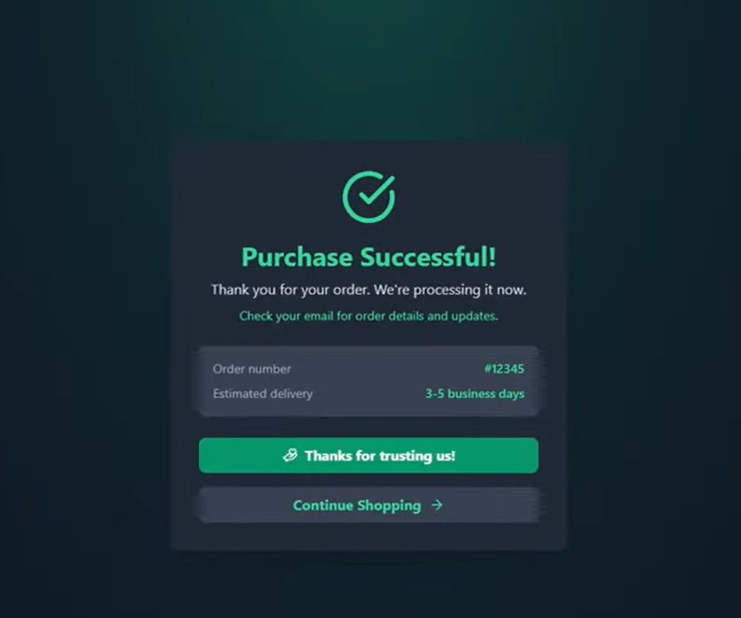
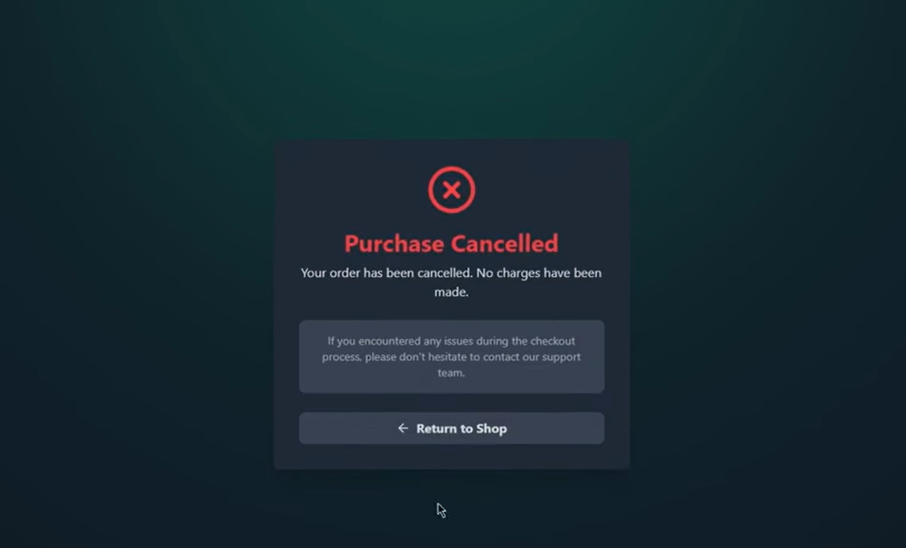
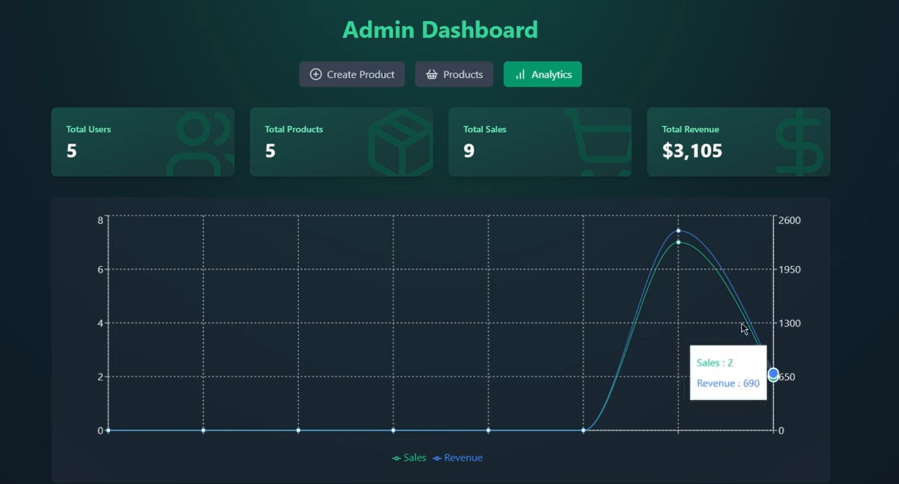
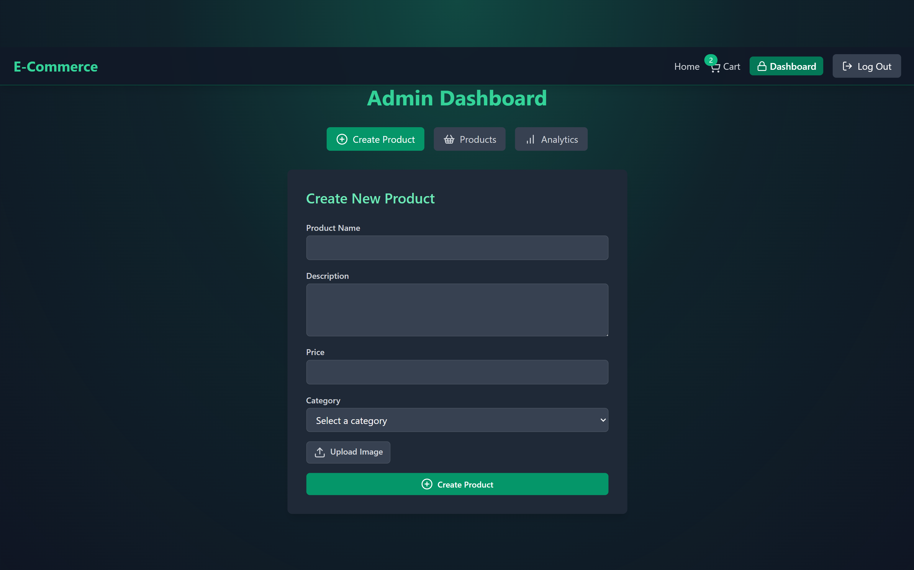
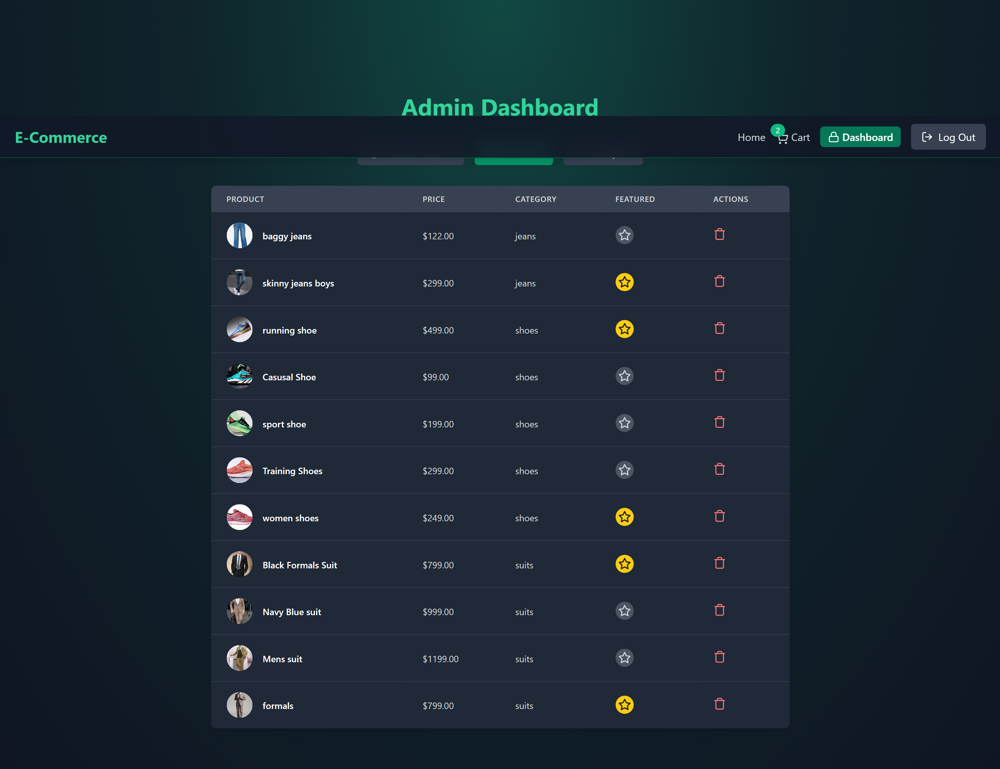

# 🛒 Full-Stack E-Commerce Platform with Admin Dashboard (MERN)

A **production-grade e-commerce application** built with a modern **MERN stack**, focused on **scalability, security, and real-world payment flows**. This project covers everything from authentication and caching to Stripe payments, admin analytics, and a polished UI.

---

## 🚀 Features Overview

### 🔧 Project & Infrastructure

* Express-based backend architecture
* Environment-based configuration with **dotenv**
* Modular & scalable folder structure
* Hot-reload during development using **nodemon**

### 🗄️ Database & Caching

* **MongoDB** with Mongoose ODM
* **Redis** caching using **ioredis** for:

  * Faster product fetches
  * Session & frequently accessed data

### 🔐 Authentication & Security

* Secure authentication system
* Password hashing with **bcryptjs**
* **JWT Authentication**

  * Access Tokens
  * Refresh Tokens
* Cookie-based token storage
* Protected routes (User & Admin)

### 💳 Payments

* **Stripe** integration
* Secure checkout flow
* Payment success & failure handling
* Coupon / discount code system

### 🛒 E-Commerce Core

* Product & Category Management
* Shopping Cart functionality
* Checkout flow with Stripe
* Order creation & tracking

### 👑 Admin Dashboard

* Create Product
* View All Products
* Sales Analytics
* Revenue & order insights (charts)

### 🎨 Frontend & UI

* **React 19**
* **Tailwind CSS** for responsive design
* **Framer Motion** for animations
* **Recharts** for analytics
* **Zustand** for global state management
* Toast notifications for UX feedback

---

## 🧰 Tech Stack

### Backend

* **Node.js**
* **Express.js**
* **MongoDB + Mongoose**
* **Redis (ioredis)**
* **JWT**
* **Stripe**
* **Cloudinary** (image uploads)

### Frontend

* **React(vite)**
* **React-Router**
* **Axios**
* **Lucide-react**
* **framer-motion**
* **Recharts**
* **zustand**

---
## 📸 Application Pages & Layouts

### 🏠 Home Page
The storefront entry point. Features high-speed loading for featured products and dynamic category navigation powered by **Redis**.



---

### 🛍️ Product Collections (Category-wise)
Deep-dive pages for specific inventories. Data is served with sub-second latency via the caching layer.

| Product Section |

  

---

### 🛒 Shopping Cart
A centralized hub for managing selected items before checkout with **Zustand** state management.



---

### 🔐 Authentication (Split 50/50 Layout)
Modern split-screen design for onboarding.

| Login Page | Signup Page |
| :---: | :---: |
|  |  |

---

### 💳 Transaction Feedback
Direct feedback after the **Stripe** payment gateway process.

| Payment Success (Confetti) | Payment Failure |
| :---: | :---: |
|  |  |

---

### 👑 Admin Dashboard (The Command Center)
A comprehensive internal toolset for managing the platform.

#### 📊 Sales Analytics & Insights
Visualizing business intelligence using **Recharts**.



#### 📦 Inventory & Creation
Manage products and upload media via **Cloudinary**.

| Create Product Form | All Products Management |
| :---: | :---: |
|  |  |

## 🔒 Security Highlights

* Hashed passwords (bcrypt)
* Secure JWT implementation
* Role-based access control
* Protected admin routes
* Secure Stripe payment flow

---

## 🚀 Performance Optimizations

* Redis caching
* Optimized API responses
* Lazy loading components
* Efficient global state management

---

## 🛠️ Setup & Installation

```bash
# Clone repository
git clone https://github.com/yourusername/ecommerce-platform.git

# Backend setup
cd backend
npm install
npm run dev

# Frontend setup
cd frontend
npm install
npm run dev
```

---

## 📌 Environment Variables

```env
MONGO_URI=
REDIS_URL=
JWT_SECRET=
JWT_REFRESH_SECRET=
STRIPE_SECRET_KEY=
STRIPE_WEBHOOK_SECRET=
CLOUDINARY_CLOUD_NAME=
CLOUDINARY_API_KEY=
CLOUDINARY_API_SECRET=
```

---

## 🌟 Final Notes

This project is designed to **mirror real-world production systems** and is perfect for:

* Portfolio projects
* Learning full-stack development
* Understanding scalable backend design

If you like this project, ⭐ star
